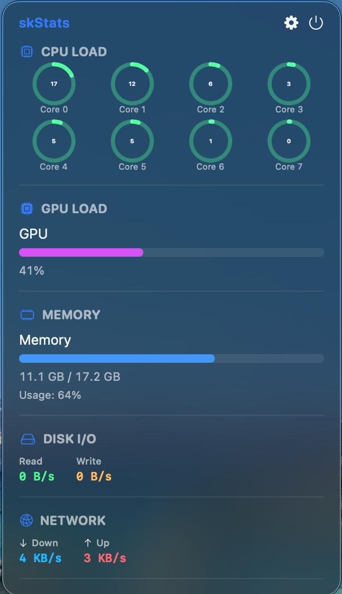

<p align="center">
  
</p>

# skStats

<p align="left">
  
  
  
  
</p>

**skStats** is a lightweight, elegant, and native macOS menu bar application designed to monitor your real-time system hardware and performance resources. Built cleanly with Swift and SwiftUI, it acts as your personal system supervisor without ever getting in your way.

> **Note**: This project is completely built by Google Gemini.

## 🚀 Features

- **Resource Leaderboards [NEW]**: Instantly see the **Top 3 CPU-consuming** and **Top 3 Memory-consuming** processes running on your Mac in real-time, helping you identify performance bottlenecks at a glance.
- **Per-Core CPU Load**: Real-time load monitoring for each individual core, using purely native responsive layout to cleanly fit any massive multi-core Apple Silicon setup.
- **Memory Usage**: Real-time RAM footprints with intelligent active data parsing (MB/GB translations).
- **GPU & Disk I/O**: Live GPU framework utilization tracking and exact Drive Read/Write delta rates.
- **Network Speed**: Instant Upload/Download network throughput.
- **Total Customization**: Toggle any of the 7 hardware/process metrics individually to keep your dashboard focused. Change update frequency anywhere from 1s to 10s easily via `UserDefaults` state saving.
- **Pure Native UX**: Operates exclusively safely in the menu bar (`LSUIElement`) without cluttering the Dock, presenting a highly polished popover dashboard interface.
- **Custom Application Icon**: Comes with a gorgeous high-fidelity icon exclusively generated by Nano Banana.

## 🛡️ Stability & DevOps

- **Zero-Leak Engineering**: skStats embraces extremely robust garbage collection practices. External Terminal bridging tasks (`ps`, `ioreg`) are strictly paired with native `.waitUntilExit()` handlers and forced Pipe disconnections, guaranteeing zero File Descriptor and Zombie Process leaks allowing it to run flawlessly 24/7.
- **Cloud CI/CD Enabled**: Features built-in **GitHub Actions**. Any code updates or Pull Requests will be automatically verified and compiled on macOS cloud runners to guarantee repository stability.

## 💻 Requirements

- macOS 13.0 or later
- Xcode / Xcode Command Line Tools

## 🔨 How to Build

### Option A: Using Xcode
1. Clone the repository.
2. Open `skStats.xcodeproj` in Xcode.
3. Select your Mac as the destination.
4. Press `Cmd + R` to Build and Run! 

### Option B: Terminal Release Build (Optimized)
To create an optimized, high-performance production build exactly like the CI workflow does:
```bash
xcodebuild build -project skStats.xcodeproj -scheme skStats -configuration Release -destination 'platform=macOS' CONFIGURATION_BUILD_DIR=$(PWD)/build/Release
```
The compiled binary `.app` will appear in the `build/Release/` directory.

## 📄 License

This project is licensed under the MIT License - see the [LICENSE](LICENSE) file for details.
